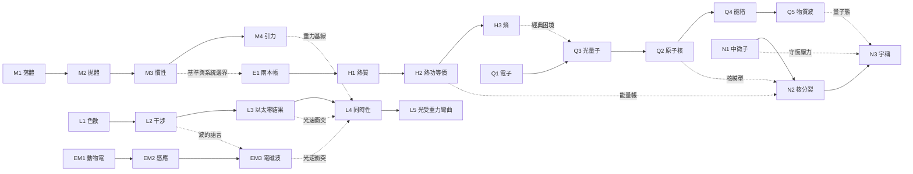

# 《發現之前》全系列物理史架構與玩家路徑

**版本**：v0.1（系列設計草案，未構成各章解凍或製作承諾）

**日期**：2026-07-21

**修訂紀錄（2026-07-22，前三章定名與 M3 候選版）**：正式章名同步為《重物的渴望》《第一寸的弧線》《船艙裡的靜止》；第三章劇本 v0.1.1 與章規格 v0.1 已凍結，候選版可玩。命名規則見《章節命名原則 v0.1》。

**位階**：受《架構計劃書 v0.3》五條憲章約束；高於未來單章前期思考，低於經審核凍結的章規格

**既有基線**：第一章《重物的渴望》、第二章《第一寸的弧線》與第三章《船艙裡的靜止》之凍結內容不因本文件改動

---

## 一、先做一個重要裁決：本作不是「物理課本年表」

物理史不可能被一款遊戲完整收錄。若把所有著名科學家與定律依年份排進去，最後只會得到一張很長的目錄，不會得到一款好玩的遊戲。

本作應採**經過策展的物理史**：每一章必須同時滿足四個條件，才有資格成為一站。

1. 有一個玩家或當代人真的可能相信的迷思。
2. 有一條能由玩家親手重建的證據鏈。
3. 有一個不同於純問答的新衝突或新判讀。
4. 能讓玩家已學會的科學方法在後續章節受到更難的考驗。

因此，捷運圖上的：

- **站點**＝一宗迷思案件，不等於一位名人的傳記。
- **線路**＝一種逐章熟成的玩家動詞，不等於課綱單元。
- **轉乘站**＝兩套證據或方法相遇，產生新的物理觀。
- **軟連線**＝建議先備能力；不做硬鎖，玩家仍可直接挑戰。
- **年份**＝史實座標，不等於遊玩順序。

一句話總結：**年代決定地圖的位置，玩家能力決定推薦路線。**

### 1.1 全系列敘事鐵律：玩家參與證據，不取代歷史

> **玩家是物理史證據鏈的參與者，不是藏在歷史背後、取代所有科學家的真正發現者。**

- 真實人物、年代、爭議、實驗、發表與成果歸屬，應盡量依史料呈現。
- 旅人進入史料未記載的空隙，參與組裝、測量、記錄、質疑、比較與判讀；不得把現代結論直接交給科學家，冒充發現過程。
- 玩家在**遊戲中的證據鏈**必須完成不可替代的一步，但歷史上的發現榮譽仍屬真實參與者。
- 歷史人物不是等待玩家開導的 NPC；他們掌握當代問題、器材限制與思想背景，玩家只掌握未來答案的方向，雙方必須合作才能讓主張在當代站得住。
- 章末史實頁以四類標記揭露：**史實／合理重建／虛構串接／傳說**。若玩法與史實衝突，優先改玩法，不改造虛假的歷史因果。

**雙重刪除測試**：

1. 從真實歷史中刪掉旅人，該發現仍應由史實人物與史實證據成立；否則玩家偷走了歷史。
2. 從遊戲章節中刪掉玩家操作，遊戲內的證據鏈應無法完成；否則玩家只是旁觀者。

本作追求的是兩者同時成立：**不偷歷史，也不偷玩家的功。**此條列為《架構計劃書 v0.4》憲章候補；在 v0.4 整併前，本系列文件與未凍結章節先行受其約束。

### 1.2 同行者可以更換，但問題必須完成接棒

**旅人與旅人筆記是系列恆常主角；歷史科學家是各站的同行者，不是玩家永遠跟隨的「主人」。**同一位科學家可連續陪伴數章，但只在史實年代、人物弧線與物理問題確實相連時保留；不得為了角色人氣扭曲壽命、相遇或成果歸屬。

每次更換同行者，章間必須完成三拍：

1. **留下未解問題**：前一章的成果自然產生下一個仍未回答的矛盾，而不是硬貼「下一章預告」。
2. **交出可見載體**：由書、信、儀器、實驗紀錄或被引用的證據，把問題從前一位科學家送到下一位；若史實無直接往來，使用公開著作或旅人筆記時間跳躍，不虛構私人會面。
3. **重新定位同行者**：新章開始 20–40 秒內交代「現在何時何地、這個人是誰、他為何接手此題」，再把第一個可操作問題交給玩家。從首頁直接挑章者也必須看得懂，不以完成前章為理解門票。

前三章示範：第一、二章由同一位伽利略延續落體至拋體；第二、三章則由伽利略 1632 年《對話》的船論證作為載體，交給 1640 年把書帶到海上的伽桑狄。科學累積的爽感應來自「玩家做過的證據成了後人的地基」，不是讓同一組角色不合史實地活遍整條物理史。

---

## 二、全系列一句話弧線

玩家從「知道正確答案卻拿不出證據」，一路走到「面對兩套都能解釋資料的理論，敢承認目前還不能裁決」。

全系列真正要養成的不是公式庫，而是十一項玩家能力：

| 能力 | 玩家真正學會的事 | 首次主教學章 |
|---|---|---|
| K1 觀察／解釋分離 | 看見現象，不等於已知道原因 | M1 |
| K2 單變因比較 | 只改一件事，結論才有指向性 | M1 |
| K3 校準與誤差診斷 | 數據不好時，先找異常跟著誰走 | M1–M2 |
| K4 預測制 | 先押下一筆，再用新資料檢驗規律 | M1 |
| K5 證據邊界 | 量到哪裡就說到哪裡，不為勝利冒領 | M1–M2 |
| K6 參考系與隱藏作用 | 先問「相對誰」與「有沒有沒看見的力」 | M3 |
| K7 守恆帳本 | 用輸入、輸出與缺口追查物理過程 | E1–H2 |
| K8 模型比較 | 不問哪套話順耳；列出各自不同的預測 | EM1–L2 |
| K9 零結果判讀 | 沒看見預期訊號，也可能是重要證據 | L3 |
| K10 從分布推回不可見模型 | 單一事件不說話，事件群的形狀才說話 | Q1–Q5 |
| K11 對稱與不變性檢驗 | 不把漂亮原則當免驗的真理 | N3 |

這十一項能力不是角色數值，也不提供「+10% 成功率」。真正的永久技能存在玩家腦中；存檔只記錄完成章節、筆記、已看教學與可選捷徑。

---

## 三、六條物理史線路

| 線路 | 核心問題 | 招牌玩家動詞 | 主要介面語言 |
|---|---|---|---|
| **M 運動與引力線** | 物體如何改變運動？地上與天上是否同一套規則？ | 配置、量測、外推 | 實驗台、刻度、軌跡、預測 |
| **H 熱與能量線** | 什麼在過程中流動、轉換或散失？ | 記帳、平衡、追缺口 | 收支帳本、流量、溫差、狀態數 |
| **L 光與時空線** | 光走哪條路？時間與同時是否屬於所有人？ | 畫路、疊加、同步 | 光路板、相位、條紋、時鐘 |
| **EM 電與磁線** | 電、磁與變化如何互相生成？ | 接線、切換、追變化 | 電路工坊、線圈、磁針、場線 |
| **Q 物質與量子線** | 看不見的微觀世界，能從哪些痕跡反推？ | 分類、擬合、比模型 | 散射分布、光譜、事件點、機率 |
| **N 原子核與對稱線** | 守恆、質量與左右對稱，究竟能信到哪裡？ | 補帳、找巧合、翻轉 | 能量預算、符合計數、鏡像測試 |

### 3.1 捷運圖骨架（年份排位置，能力排推薦路線）

這張圖刻意不是一條主幹加五條支線。玩家會沿某條線熟成一種操作語言，再在轉乘站被迫借用另一條線的方法；轉乘才是全系列最有價值的章節。

### 線路之間最重要的轉乘

- **M3 → E1**：先學會指定參考物與運動系統；進入碰撞章後，再用同一套邊界意識分開「動量」與「活力／能量」兩本帳。
- **M4 ↔ L4/L5**：牛頓引力是時空革命必須正面超越的舊基線，不是丟掉的廢案。
- **L2 + EM2 → EM3**：波的干涉語言與場的變化，在「光是電磁波」相遇。
- **H3 + L2 → Q3**：連續的經典波與熱平衡同時撞牆，量子問題才出現。
- **L3 + EM3 → L4**：光速與參考系的衝突，逼玩家重做「同時」的定義。
- **Q2 + H2/L4 → N2**：原子核模型、能量帳本與質能關係共同解讀核分裂。
- **N1 + Q5 → N3**：守恆與量子態的玩家，最後接受「對稱本身也必須受審」。

---

## 四、24 章全目錄

### M 線｜運動與引力：配置、量測、外推

#### M1《重物的渴望》｜1590–1604｜已完成

- **案件問題**：重的東西真的掉得比較快嗎？
- **重要物理**：落體距離隨時間平方增加；等時距位移呈奇數列；在同介質、同形狀等條件下，規律不因球重改變；空氣阻力與形狀不可混為重量效應。
- **玩家主要動作**：設計斜面測量、換球與換傾角複驗、預測第五段、用對照實驗拆解介質與形狀。
- **方法戰利品**：單變因、預測制、校準、證據邊界。
- **對手升級**：吞噬者——能把孤例吸收進舊理論；玩家必須提出正面的規律。

#### M2《第一寸的弧線》｜1608｜已完成

- **案件問題**：物體往前飛與往下落，是同一件運動還是兩件同時發生的運動？
- **重要物理**：水平與垂直運動可分開描述；相同發射條件下，落下高度決定飛行時間尺度，水平射程跟著時間改變；忽略空氣阻力時，質量不改變運動骨架；真實外彈道會偏離理想模型。
- **玩家主要動作**：組裝與校準彈射台、升降沙盤、預測射程、換球複驗、辨讀敵方數據卡。
- **方法戰利品**：裝置設計、運動分解、模型適用範圍。
- **對手升級**：歸檔者＋持械者——對手用玩家的數字與邊界反擊誇口。

#### M3《船艙裡的靜止》｜1632–1642｜候選版可玩

- **案件問題**：航行中的船從桅頂放下一顆石頭，為什麼沒有被船丟在後面？
- **史實主軸**：伽利略 1632 年《對話》提出船艙共同運動論證；伽桑狄約於 1640 年秋在馬賽把船桅落石搬上真正航船，1642 年出版運動研究。日期 1640／1641 的資料差異於史實頁揭露。
- **重要物理**：石頭保留與船共有的水平運動；近似直線勻速時，船上普通局部機械現象與停船近乎相同；加速／減速會留下相對偏移；船上直落與岸上彎曲路徑是同一事件在不同參考物下的兩份正確記錄。
- **玩家主要動作**：校準桅頂落石、辨認搶跑造成的失敗、控制穩速／加速／減速窗口、比較船艙滴水與拋接、切換參考物並疊合船上／岸上兩份紙帶。
- **關鍵謎題**：不是背出「慣性」，而是說清楚物體原本跟誰一起走、什麼改變了共同運動，以及兩張不同軌跡為何都可能正確。
- **證據邊界**：實驗能排除「落石必落後，所以地球不能動」這項反對，不能單獨直接證明地球運動；普通局部機械實驗與直線穩速的限定不得擴張成絕對不可偵測地球自轉。
- **章末形式**：公開演示＋三道質詢；終局誘惑是撤回「因此證明地球在動」的過強主張，不再打一場三支柱法庭。

#### M4《月亮一直在掉》｜1665–1687｜候選／M 線終站

- **案件問題**：月亮若受重力，為何沒有掉到地上？
- **重要物理**：向心加速度、反平方趨勢、地表落體與天體軌道可由同一引力框架描述；模型跨尺度外推。
- **玩家主要動作**：把 M1 的落體骨架、M2 的拋體與天文觀測拼成多尺度模型；調整距離律，預測月球與行星資料。
- **關鍵衝突**：笛卡兒渦旋與引力模型都能講故事，玩家必須比較可計算預測與剩餘誤差。
- **歷史邊界**：不演「蘋果落下，牛頓立刻發現萬有引力」；以 Hooke、Halley、Flamsteed 等協作與爭議呈現。

### H 線｜熱與能量：記帳、平衡、追缺口

#### E1《兩本帳，哪一本是真的？》｜1720–1740｜M/H 轉乘

- **案件問題**：碰撞中應記 `mv`，還是記跟 `mv²` 有關的量？
- **重要物理**：動量與動能回答不同問題；守恆量必須連同系統、方向與作用型態一起說；「同一個力」的舊詞其實混裝了兩種帳。
- **玩家主要動作**：重播彈性與非彈性碰撞；分別做帶方向的動量帳與形變／升高能力帳；找出哪本帳在何種條件下閉合。
- **敘事核心**：Émilie du Châtelet 不當彩蛋，而是能迫使雙方重寫問題的人。
- **最佳結局**：不是二選一；玩家命名兩種不同物理量並限定用途。

#### H1《熱從哪裡來？》｜1798｜候選

- **案件問題**：熱是一種會被器物儲存並流出的物質嗎？
- **重要物理**：摩擦生熱、熱質說的解釋力與困難、持續做功可持續產熱；單次結果不足以宣布整套理論死亡。
- **玩家主要動作**：管理鑽炮、冷卻水與工時；做熱量收支帳；比較「有限熱質流出」與「機械過程持續生成」的預測。
- **對手型態**：對稱者初階——兩套模型都能吃掉部分證據。
- **最佳結局**：熱質說受到重傷，但保留「還需要定量等價」的未決事項，送往 H2。

#### H2《一度熱，值多少墜落？》｜1843–1850｜候選

- **案件問題**：落下的重物攪熱一桶水，機械功與熱能否用固定比例兌換？
- **重要物理**：機械功與熱的等價、能量轉換、熱漏與環境修正、微小訊號的重複測量。
- **玩家主要動作**：搭配砝碼、槳輪與溫度計；校正散熱；用不同裝置交叉取得同一兌換率。
- **關鍵難題**：溫升極小；真正的 boss 是儀器解析度與熱漏，不是算式。
- **方法戰利品**：跨裝置不變量、能量總帳。

#### H3《為什麼碎片不會自己回去？》｜1850–1877｜候選／H 線終站

- **案件問題**：微觀運動若可逆，為什麼宏觀世界有明顯的時間方向？
- **重要物理**：熵、巨觀狀態與微觀狀態數、第二定律的統計性、可逆定律與不可逆經驗的張力。
- **玩家主要動作**：不直接背公式；用粒子盒、分區與狀態計數比較「可能方式有多少」；設計一個看似逆轉但其實偷偷做了外功的裝置。
- **對手型態**：速答者——有人太快把「熵增加」說成宇宙絕對禁令，玩家必須補回統計與系統邊界。
- **最佳結局**：能說「極不可能」而不假裝「邏輯不可能」。

### L 線｜光與時空：畫路、疊加、同步

#### L1《白光的罪名》｜1666–1672｜候選

- **案件問題**：稜鏡製造了顏色，還是把白光裡已有的成分分開？
- **重要物理**：色散、折射率與顏色的關聯、重組白光、判決性實驗。
- **玩家主要動作**：安排孔徑與兩枚稜鏡；追蹤單色光再通過第二稜鏡；把分開的色光重新合成。
- **核心爽點**：不是看到彩虹，而是設計能讓兩個模型給出不同預測的第二道稜鏡。

#### L2《亮加亮，為什麼會暗？》｜1801–1819｜候選

- **案件問題**：兩束光相遇，為什麼有些地方反而變暗？
- **重要物理**：波的疊加、相位差、干涉條紋、波長；波模型與粒子模型的不同預測。
- **玩家主要動作**：調整兩路光程、孔隙距離與波長；先畫各模型預測，再開光比較條紋。
- **對手型態**：對稱者——雙方都能解釋反射折射，玩家必須找預測真正分岔的位置。
- **歷史邊界**：避免把現代教科書的「一場標準雙縫」直接冒充 Young 當時唯一而完整的證據。

#### L3《沒有移動的條紋》｜1881–1887｜候選

- **案件問題**：若地球穿過承載光的以太，轉動干涉儀時條紋為什麼沒有按預期移動？
- **重要物理**：干涉儀、方向差測量、零結果、靈敏度與系統誤差、以太漂移假說。
- **玩家主要動作**：校準干涉儀、轉台、估計應有條紋位移、證明儀器看得見比目標更小的變化。
- **關鍵教學**：零結果要有檢出能力才是證據；「沒看到」不能自動等於「不存在」。
- **歷史邊界**：不寫成「Michelson–Morley 一晚殺死以太，Einstein 隔天發明相對論」。本章只留下必須處理的矛盾。

#### L4《誰的「同時」？》｜1905｜候選／L–M–EM 轉乘

- **案件問題**：相隔兩地的事件是否同時，誰有權決定？
- **重要物理**：同時性的操作定義、光速不變、慣性參考系、時間膨脹與長度收縮的定性來源。
- **玩家主要動作**：鋪設時鐘與光訊號、訂同步規則、比較列車與月台的事件表；找出「同時」在哪一步被偷當成絕對。
- **章末形式**：不是用數據打倒某教授，而是把兩套互相衝突的規則重寫成自洽系統。
- **鐵律**：不以代公式計算作為過關條件。

#### L5《太陽旁邊的星星》｜1919｜候選／進階支線

- **案件問題**：星光掠過太陽時真的彎了嗎？照片上的偏移足以裁決嗎？
- **重要物理**：重力對光路的影響、廣義相對論與牛頓式預測差異、影像測量、誤差棒與選片偏差。
- **玩家主要動作**：配準日食與夜空底片、標星、排除熱變形與劣片；在兩個接近的預測間做證據審計。
- **最佳結局**：給出帶可信度與限制的判定，不演「一張照片證明天才絕對正確」。

### EM 線｜電與磁：接線、切換、追變化

#### EM1《青蛙腿裡有電嗎？》｜1780–1800｜候選

- **案件問題**：蛙腿抽動來自動物自身的電，還是兩種金屬接觸產生的電？
- **重要物理**：閉合路徑、不同金屬與組織的角色、電位差、早期生物電；Galvani 與 Volta 各自抓到真問題的一部分。
- **玩家主要動作**：組接金屬、鹽水、蛙腿與非生物檢測器；用單變因矩陣尋找抽動跟著哪個條件走；最後組出伏打電堆。
- **對手型態**：對稱者成熟版——遊戲允許「兩人都不是全錯」。
- **最佳結局**：不是宣判 Galvani 愚蠢；區分生物電現象與金屬／電解質電源。

#### EM2《磁鐵不動，電就不來》｜1820–1831｜候選

- **案件問題**：磁鐵放在線圈旁為何沒有電，移動時卻有？
- **重要物理**：電流的磁效應、電磁感應、變化的磁通量而非「磁鐵本身」造成感應訊號、方向規則。
- **玩家主要動作**：接線圈與檢流計；改變磁鐵速度、方向、匝數與是否閉路；找出訊號只在變化期間出現。
- **核心回饋**：場的變化用時間軌跡呈現，不把一張靜態場線圖當答案。

#### EM3《光，是電與磁的遠行》｜1864–1888｜候選／EM–L 轉乘

- **案件問題**：紙上的電磁方程算出一個速度，為什麼恰好與光速相同？
- **重要物理**：電磁波、自我傳播的變動電場與磁場、波速、Hertz 的產生與接收實驗。
- **玩家主要動作**：先在模型板補齊變動場的連鎖，再搭火花發射器與環形接收器；以距離、遮蔽、反射與共振排除直接電耦合。
- **章末形式**：數學預測跨二十餘年交棒給實驗驗證；主角不由一位「孤獨天才」包辦。

### Q 線｜物質與量子：分類、擬合、比模型

#### Q1《陰極射線是什麼？》｜1897｜候選

- **案件問題**：陰極射線是以太中的波、帶電粒子，還是某種原子碎片？
- **重要物理**：帶電粒子在電場與磁場中的偏轉、荷質比、電子作為跨材料共同成分。
- **玩家主要動作**：換陰極材料、調電磁場、量彎曲半徑；比較「材料特有」與「共同微粒」模型預測。
- **方法戰利品**：從可見軌跡反推不可見物件的性質。

#### Q2《原子裡幾乎是空的》｜1909–1911｜候選

- **案件問題**：α 粒子穿過金箔時，為什麼極少數會大角度折返？
- **重要物理**：散射分布、原子核、尺度差、少數極端事件對模型的殺傷力。
- **玩家主要動作**：收集大量閃爍點、調箔厚與材料、把角度分布與均勻電荷／集中電荷模型比較。
- **關鍵教學**：不能因「大多數直走」刪掉少數離群值；離群事件可能正是核心證據。
- **歷史角色**：Geiger、Marsden 的測量工作與 Rutherford 的模型推論分開呈現。

#### Q3《光是一份一份的嗎？》｜1900–1916｜候選／H–L–Q 轉乘

- **案件問題**：為什麼更亮的低頻光仍打不出電子，更暗的高頻光卻可以？
- **重要物理**：光電效應、頻率門檻、光量子能量、強度改變光電子數目而非單顆最大能量。
- **玩家主要動作**：獨立改變光的頻率與強度，量截止電壓與計數；讓連續波模型與量子模型先押不同預測。
- **歷史邊界**：不說「光從此被證明只是一顆顆粒子」；這是後續波粒張力的開端。

#### Q4《原子只唱幾個音》｜1913｜候選

- **案件問題**：氫原子為什麼只發出少數離散顏色，而不是所有頻率？
- **重要物理**：線光譜、離散能階、躍遷能量；Bohr 模型的成功範圍與失敗範圍。
- **玩家主要動作**：把譜線分群、尋找共同能量差、組裝可產生觀測譜線的最小能階圖；再用氦或精細結構撞出模型邊界。
- **最佳結局**：模型可以極有用又不是真實原子的最後圖像。

#### Q5《電子也會繞路》｜1924–1927｜候選／Q 線終站

- **案件問題**：本來被當成粒子的電子，為何會留下像波的繞射圖樣？
- **重要物理**：物質波、繞射、統計累積、單次事件與機率分布的差別。
- **玩家主要動作**：逐顆發射電子、改晶格間距與動量、讓事件點慢慢長成分布；比較粒子直線模型與波長模型。
- **鐵律**：不得讓動畫假裝看見電子的「真實路徑」；玩家只看見可偵測事件與統計分布。

### N 線｜原子核與對稱：補帳、找巧合、翻轉

#### N1《少掉的能量去哪裡了？》｜1914–1956｜候選

- **案件問題**：β 衰變中的電子能量不固定，是能量守恆失效，還是有看不見的東西帶走差額？
- **重要物理**：連續 β 能譜、能量與動量守恆、中微子假說、符合計數與反應器開關對照。
- **玩家主要動作**：先做衰變能量帳；允許「守恆可能失效」成為真候選；跨越二十多年後設計延遲符合訊號並做反應器開／關比較。
- **對手型態**：誠實對稱者——兩種激進解釋都可活著，直到新檢測出現。
- **最佳結局**：假說不是因漂亮獲勝，而是因預測到新的可觀測訊號。

#### N2《裂開後，為什麼更輕？》｜1938–1939｜候選

- **案件問題**：轟擊鈾後出現鋇，究竟是量錯、化學污染，還是原子核真的裂開？
- **重要物理**：核分裂、質量虧損與能量釋放、碎片辨識、中子誘發反應。
- **玩家主要動作**：先以化學分離確認產物，再用液滴模型與質能帳解讀「不可能的鋇」；比較污染、微小剝落與整體裂分三模型。
- **歷史核心**：Hahn、Strassmann 的化學證據與 Meitner、Frisch 的物理解釋必須各自被看見；不把合作史縮成單一英雄。
- **倫理邊界**：章末開啟應用與戰爭後果的史實頁，但不把倫理重量做成廉價善惡選項。

#### N3《鏡子裡的自然一樣嗎？》｜1956–1957｜候選／全系列終站

- **案件問題**：把實驗左右鏡像，物理結果必然一樣嗎？
- **重要物理**：宇稱、弱作用中的宇稱不守恆、低溫極化、β 粒子方向不對稱；對稱原則也必須接受實驗。
- **玩家主要動作**：先辨識「旋轉」與真正「鏡像」；組裝低溫極化與方向計數；反轉磁場、交換探測器，排除裝置偏差。
- **最終 boss**：不是守舊教授，而是玩家自己已經愛上的漂亮原則。
- **全系列結語**：科學不是從不相信任何東西；是連最值得相信的東西，也知道如何讓它接受檢驗。

---

## 五、推薦遊玩路線與地圖解鎖

### 5.1 新手主幹

前兩章維持必經，因為它們共同教完本作的基本語法：

`M1 重物的渴望 → M2 第一寸的弧線 → 物理史地圖全面開放`

M2 完成後，玩家不再被迫照單一時間線前進。首頁提供：

- **繼續推薦路線**：依能力難度安排下一站。
- **打開物理史地圖**：自由選線，進階章顯示「建議先備」但不鎖。
- **跟隨一條線**：想專玩力學、光學或電磁者可沿色線走到底。

### 5.2 首次遊玩的推薦主路線

`M1 → M2 → M3 → L1 → M4 → E1 → EM1 → H1 → L2 → EM2 → H2 → EM3 → H3 → L3 → Q1 → Q3 → L4 → Q2 → Q4 → L5 → Q5 → N1 → N2 → N3`

這條順序大致尊重年代，但在必要處以玩家能力優先。例如 EM3 先於 L3，是因為玩家先理解「光是電磁波」，才能真正感受到以太漂移零結果為何棘手。

### 5.3 軟先備，不做 RPG 硬門

每站資料定義：

- `recommendedAfter`：建議完成的章節。
- `requiresSkill`：本章會考的玩家能力。
- `fallbackBrief`：未玩前章時提供的最短史料／證據摘要。
- `carriedEvidence`：玩過前章時可直接引用的本人筆記。

有前章存檔，玩家帶著自己做過的證據進場，獲得較短教學、特殊台詞或另一條論證路；沒有存檔仍可玩完整章節，不改變物理結果。

---

## 六、玩家在三個尺度上「怎麼動」

### 6.1 系列尺度：選線與轉乘

1. 首頁先顯示「繼續目前案件」。
2. 選擇章節時才展開物理史線路圖。
3. 玩家可沿單線前進，也可在轉乘站跳線。
4. 每完成一章，節點點亮；相關人物、器材、證據與未決問題寫入旅人筆記。
5. 地圖不把「未玩」畫成「你不夠格」；只標「建議先備」與可能少掉的跨章聲部。

### 6.2 單章尺度：七拍案件循環

未來每章原則上遵循七拍，但可調換順序，避免公式化：

1. **異常**：當代理論解釋不了的一個刺。
2. **立約**：把爭議改寫成可判斷的兩個或多個預測。
3. **造器**：選器材、控制變因、校準；必要時使用工坊。
4. **押注**：在新資料出現前先寫下預測。
5. **取證**：執行、診斷失敗、取得可追溯紀錄。
6. **對抗**：論辯、模型決鬥、數據審計或公開演示，不固定只有法庭。
7. **封存**：玩家寫下「我們知道什麼／還不知道什麼」，史實頁揭露改編與後續。

### 6.3 操作尺度：玩家動詞必須比章名更早被設計

每章最多：

- 1 個主要新動詞。
- 1 種主要視覺化。
- 0–1 個新資源。
- 約 70% 重用敘事、實驗、證據、辯論與存檔骨架；30% 提供新鮮感。

若一章只能靠「讀完史實→回答選擇題」，即使物理概念重要也不製作。

---

## 七、對抗形式必須逐步進化

若 24 章都用三支柱辯論，玩家在第五章就會看穿模板。終局形式應輪替：

| 形式 | 玩家在做什麼 | 適合章節 |
|---|---|---|
| 支柱辯論 | 找出可反證證詞，以證據擊破 | M1、M2 |
| 公開演示 | 讓觀眾先押答案，再用操作翻轉 | M3、L1 |
| 模型決鬥 | 讓兩套模型先列不同預測，再開資料 | H1、L2、EM1 |
| 數據審計 | 判斷儀器、樣本、偏差與結論是否相稱 | H2、L3、L5 |
| 組合證明 | 把不同年代、不同尺度的證據組成一條鏈 | M4、EM3 |
| 暫緩裁決 | 說明現有證據為何不足，設計下一個實驗 | H3、N1 |
| 反駁自己人 | 撤回過強主張、補限定、標記越界 | H3、Q4 |
| 對稱翻轉 | 系統性反轉裝置，排除假不對稱 | N3 |

「贏」也必須逐步改變：早期是說服對手；中期是讓模型接受邊界；後期可以是誠實地保留兩種可能，或證明一個零結果真的有意義。

---

## 八、整體敘事弧與終點

### 第一部｜證據會反咬（M1–M4）

玩家學會：知道答案沒有用；孤例會被吞掉；規律、預測與邊界才有重量。

### 第二部｜自然不只一本帳（E1、H1、EM1、L1–L2）

玩家開始遇到「兩邊都不是笨蛋」的爭論。遊戲不再保證每一章都有一位錯得乾淨的教授。

### 第三部｜看不見的東西留下痕跡（EM2–EM3、H2–H3、L3、Q1）

玩家從直接看物體，進化成從場、熱漏、條紋、散射與分布推回不可見模型。

### 第四部｜經典世界裂開（L4–L5、Q2–Q5）

時間、光與物質不再服從直覺。此時玩家已不能靠「把現代答案說出口」過關，因為現代答案本身需要被建構。

### 第五部｜連守恆與對稱也要受審（N1–N3）

玩家面對整個系列最危險的誘惑：為了保住漂亮原則而發明看不見的東西。遊戲要求玩家證明那個東西會留下什麼新訊號，最後再親手推翻另一個漂亮原則。

終幕回到現代。物理史地圖沒有「全亮完成」的假象；1957 之後仍延伸出未命名的暗線。玩家帶回的不是一本答案，而是一句新的操作原則：

> **任何主張，都要說得出下一個可能讓它失敗的實驗。**

---

## 九、明確非目標

1. **不宣稱涵蓋全部物理史**：聲學、流體、凝態、宇宙學、半導體與粒子標準模型暫不進核心 24 章；可在驗證核心產線後擴線。
2. **不照課綱填格**：課綱對位是副產品，不能逼一個不好玩的概念成章。
3. **不做名人集郵**：角色因證據鏈需要而出場；每站可有多人協作，不能把發現壓成孤獨天才神話。
4. **不把公式回憶當門票**：學者模式可要求定量推理，但公式由操作、圖形與資料長出來。
5. **不讓跨章存檔變成 RPG 數值優勢**：前章只提供理解、敘事聲部與便利，不改寫物理真相。
6. **不一次承諾製作 24 章**：本文件是導航圖；每章仍須經「前期思考→劇本／規格審查→灰盒→美術」獨立解凍。

---

## 十、每章開工前的必要門檻

未來任何候選章，必須先交一頁「案件資格表」：

- [ ] 一句話迷思與一句話物理核心。
- [ ] 玩家不可替代的操作是什麼？
- [ ] 至少兩個競爭解釋各自預測什麼？
- [ ] 錯誤設計會留下什麼可分辨的失敗？
- [ ] 本章新增哪一個玩家動詞？是否超過 30% 新系統預算？
- [ ] 刪掉 NPC 揭曉台詞，玩家仍能自己得出結論嗎？
- [ ] 哪些歷史情節是史實、合理重建、虛構串接或傳說？
- [ ] 完成後玩家能用「我做了什麼→數據怎麼變→為何足以下結論」回述嗎？
- [ ] 若結論是「暫不能裁決」，下一個可分辨實驗是否清楚？
- [ ] 該章真的比做成旅人筆記支線更值得嗎？

---

## 十一、史實風險與來源錨點

本文件只決定案件方向，不代表未來劇本可直接引用流行敘事。每章解凍前仍需建立史實 dossier，至少包含一份原始文獻與一份現代史學研究。已確認的起始錨點如下：

- Newton 1687《Principia》的運動定律與世界體系原文：[Newton Project](https://newtonproject.ox.ac.uk/view/texts/normalized/NATP00077)。
- Volta 1800 致 Joseph Banks 的電堆信件：[Royal Society Archives](https://makingscience.royalsociety.org/items/l-and-p_11_137/letter-account-of-electricity-excied-by-contact-and-conducting-substances-of-different-kinds-from-alessandro-volta-to-joseph-banks)。
- Faraday 1831 電磁感應實驗論文與研究紀錄：[Royal Society Archives](https://makingscience.royalsociety.org/items/pt_20_4/paper-experimental-researches-in-electricity-by-m-michael-faraday)、[Royal Institution](https://www.rigb.org/explore-science/explore/collection/history-research-ri)。
- Joule 1849／1850〈On the mechanical equivalent of heat〉手稿與出版紀錄：[Royal Society Archives](https://catalogues.royalsociety.org/CalmView/Record.aspx?AddBasket=PT%2F37%2F3&id=PT%2F37%2F3&src=CalmView.Catalog)。
- Maxwell 1865〈A Dynamical Theory of the Electromagnetic Field〉：[Smithsonian Libraries 數位本](https://library.si.edu/digital-library/book/dynamicaltheoryo00maxw)。
- Michelson–Morley 1887〈On the Relative Motion of the Earth and the Luminiferous Ether〉：[American Journal of Science 原刊](https://ajsonline.org/article/62505-on-the-relative-motion-of-the-earth-and-the-luminiferous-ether)。
- Rumford 1798 鑽炮生熱論文：[原始論文掃描本](https://www3.nd.edu/~powers/ame.20231/thompson1798.pdf)；只能作為 H1 起點，不得直接寫成熱質說的單場死刑。
- Young 的 Bakerian Lecture 原始出版物：[Wellcome Collection](https://wellcomecollection.org/works/u5dr8rgg)；L2 需另外核對實驗呈現，避免倒灌現代標準雙縫敘事。
- Rutherford／Geiger／Marsden 的原子散射史，須分開標示「實驗者」與「模型提出者」。
- Pauli 1930 中微子假說信件：[CERN Document Server](https://cds.cern.ch/record/83282?ln=en)；[Cowan–Reines 1956 偵測論文](https://www.nature.com/articles/178446a0)另立證據段。
- [Meitner–Frisch 1939 核分裂物理解釋](https://www.nature.com/articles/143239a0)與 Hahn–Strassmann 化學結果不可合併成單人發現。
- [Wu、Ambler、Hayward、Hoppes、Hudson 1957 宇稱實驗](https://doi.org/10.1103/PhysRev.105.1413)須保留團隊署名與低溫／極化條件。

特別禁止直接採用的常見神話：蘋果瞬間生成萬有引力、Rumford 一次實驗徹底殺死熱質說、Michelson–Morley 直接導致 Einstein、Young 用一場現代教科書式雙縫獨力證明光波、Rutherford 一人完成全部金箔實驗、Meitner 單獨或 Hahn 單獨「發現核分裂」。

---

## 十二、待總監裁決（不阻擋首頁與第二章）

1. **系列邊界**：核心故事是否以 N3（1957 宇稱不守恆）作為正式終站？本案推薦「是」；它在主題上比硬追到 Higgs 或重力波更完整。
2. **章數定位**：24 章是完整藍圖，不是近期 roadmap。建議公開只承諾「下一章」，內部才保留全圖。
3. **L5 定位**：1919 日食章建議列為進階支線；它的證據審計價值很高，但不是進入量子線的必要站。
4. **地圖公開程度**：未凍結章只顯示線路與模糊站影，不公開章名與日期，避免把思考稿變成對玩家的交期承諾。
5. **第三章製作狀態（已裁、已執行）**：正式章名為 M3《船艙裡的靜止》；劇本 v0.1.1 與章規格 v0.1 已凍結，候選版可玩。舊版檔名保留工作名以維持引用，不代表正式章名仍在使用。
